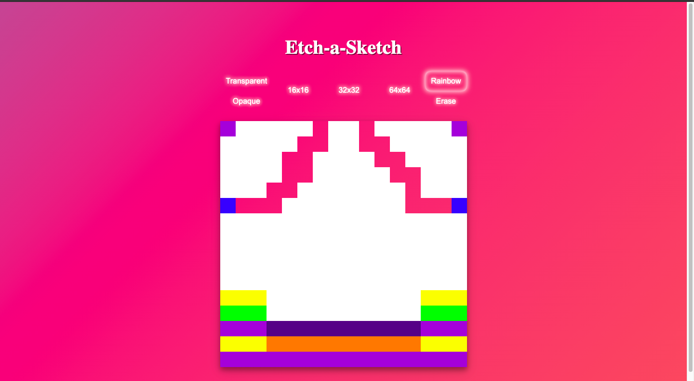

## Project: Etch-a-Sketch
  This is a browser version of toy similar to Etch A Sketch or sketchpad

🔗 **Live preview** of my web toy is [here](https://avasthiabhyudaya.github.io/Etch-a-Sketch/).

Huge thanks to [Rio](https://github.com/riverBanjo) for helping me with this project.

### Outcome of this project: ###
* Deepened knowledge of **DOM** and its **manipulation**.
* Improved **CSS Grid** understanding and usage.
* Greatly improved **functionality** in general (shortened, optimized and reusable functions).
* Instead of prompt, I added three grid size options for **better UX** and **UI**.

### My web toy in action: ###

